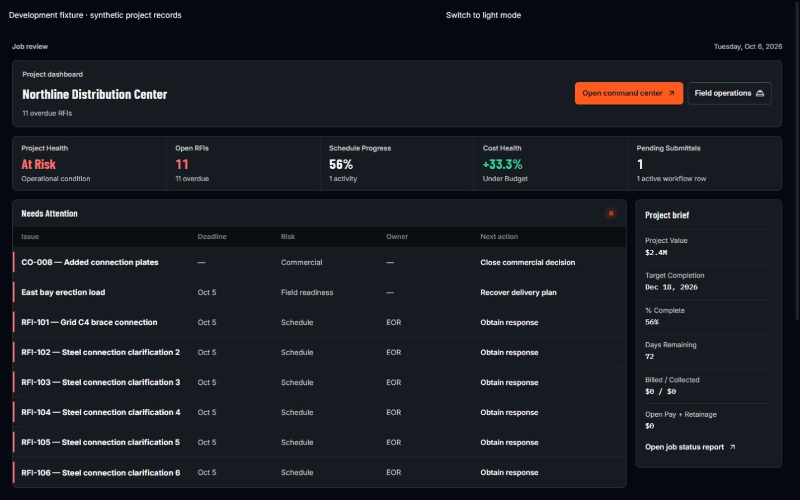
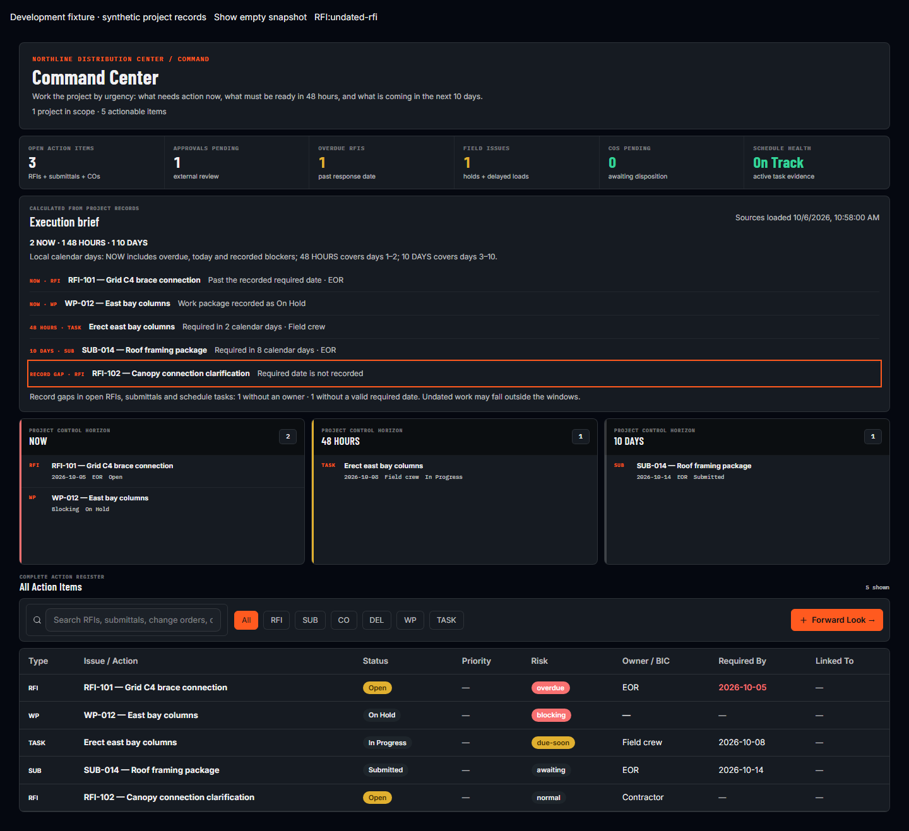
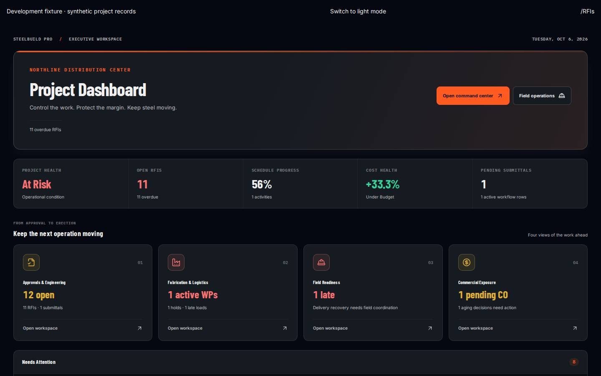

# Steel executive workspace and reliability release

Date: 2026-10-07. Base: `948c7de7342539a95450d1c014c9991e88ba9be0`.
Branch: `codex/steel-executive-hardening`.

Current backend status: seven approved migrations and seven source-verified Edge Functions are applied only to staging. Account-delete v5 passed the real MFA/ownership denials, journal recovery and final disposable-account cleanup; MFA readiness reports zero gaps. Billing/read-service configuration, five high development-dependency findings, production authorization, native delivery and operational acceptance remain open. Neither frontend Worker was replaced. The earlier verification sections below remain tied to their named commits; see the [current staging acceptance record](STAGING_ACCEPTANCE_2026-10-07.md) and the approved staging continuation below.

## Construction design refinement

The latest interface puts the actual job name and operating metrics above a compact decision register. At 1440 × 900, eight priority rows are visible without scrolling. Steel workflow destinations remain explicit: engineering approvals, fabrication/logistics, field readiness and commercial exposure. Command Center now uses one complete action register with horizon filters, while its execution brief summarizes exceptions and missing responsibility/dates. Overdue holds remain counted as holds independently of urgency. Desktop and mobile share the existing brand mark, readable working type and accessible navigation. The virtual 115-record phone register retains reachable columns and keyboard source actions.

The [construction design refinement record](CONSTRUCTION_DESIGN_REFINEMENT_2026-10-07.md) contains current dark/light screenshots and verification. Its synthetic fixtures mount the shipped presentation; they do not represent customer data or a deployed frontend. It supersedes the earlier presentation screenshots below.

Final interface source `3157e32c5d212162ca9a1ff2d00cc83045442cc5` passed the complete [application CI job](https://github.com/lorteezy87/SteelBuild-Pro-Rev.2/actions/runs/37601851704/job/112727859371): 7,458 unit tests in 781 files, all 76 browser checks, four type gates, lint, source policy, isolated database boundary checks, build and unchanged bundle budgets. Secret scan and Edge typecheck passed. The full dependency audit and seven-migration production drift hold remain; the overall workflow is not green. The final evidence checkpoint changes documentation, screenshots and coordination metadata only.

## Continuation: security and the first intelligence increment

The continuation adds a calculated execution brief to the live Command Center. All six source families must load completely, remain in the selected project, and stay below the pagination safety cap. The brief uses the existing calendar horizons, links to source records, reports owner/date gaps, and distinguishes refreshing/error states from a complete snapshot. It adds no model connection or autonomous action. [Intelligence delivery sequence](../roadmaps/STEELBUILD_INTELLIGENCE.md).

Offline field replay now binds captures to the original user/workspace, holds the original token, and checks cancellation at the actual SDK transport boundary. Account changes, workspace-generation changes and unmount stop later requests, retries, queue reconciliation and stale success messages. The existing client_op_id deduplication remains intact. Legacy ownerless captures require recovery before the existing sign-out purge; see [local ownership and retention](../runbooks/local-data-ownership.md).

The server MFA release covers authenticated REST/RPC, private Storage operations, currently published Realtime tables, and seven user-facing Edge endpoints. The browser challenge also waits for the verified profile before opening the app. The release has isolated PostgreSQL, real-handler and Deno checks; hosted staging acceptance now covers REST, Storage, Realtime and five configured Edge handlers, including account-delete. Billing and command-center-read retain 503 configuration holds, and production remains unapproved. [Exact backend candidate and observed deployed versions](BACKEND_RELEASE_CANDIDATE_2026-10-07.md).

The complete dependency audit improves from 16 findings to five inherited from one unpatched upstream Braces vulnerability. Production dependencies remain at zero advisories and zero waivers. [Compatibility and audit evidence](DEPENDENCY_TOOLCHAIN_2026-10-07.md).

Browser acceptance now requires authenticated main content, complete project context, successful scoped API responses and actual fixture rows. Login pages, error states and forbidden data writes cannot count as success. Synthetic checks are separate from real authenticated staging acceptance.

[Field-phone light-theme brief](evidence/command-brief-light-mobile.png). These captures show the shipped component with synthetic records; they do not establish backend deployment or live-account acceptance.

## Continuation verification record

Application source commit `2d9bf6e69827ecf471def2adbb7e31060b13d261` is the continuation candidate. Local execution is now available. The following checks passed locally and the complete application job independently passed on that exact source in [push run 37591398899](https://github.com/lorteezy87/SteelBuild-Pro-Rev.2/actions/runs/37591398899/job/112693493075):

| Check | Result |
|---|---|
| Vitest | 7,446 tests in 780 files passed |
| Browser acceptance | 70 passed across desktop/mobile; executive and brief fixtures cover both themes |
| ESLint and all four type gates | Passed; no ratchet-ignore growth |
| New-source TypeScript policy | Passed |
| Isolated database verification | MFA boundaries, account deletion and eight helper search paths / 3,929 result cases passed |
| MFA Edge guard tests | 23 tests passed, including actual handler bodies |
| Production build and bundle budgets | Passed: initial 162.8 KB gzip / 320 KB; total 3,192.9 KB gzip / 3,600 KB |
| Production dependency audit | Zero advisories, zero waivers |
| Complete dependency audit | Five high findings in the upstream Braces/Tailwind tooling chain; unresolved |

The same push run passed the secret scan, every Edge Function entrypoint typecheck and the production-dependency audit. The complete-dependency audit remains failed for the five documented high findings; production drift remains failed for the five required pending migration versions. Deployment and authenticated staging jobs were skipped. The overall workflow is therefore not green despite the passing application job. [CI browser evidence](https://github.com/lorteezy87/SteelBuild-Pro-Rev.2/actions/runs/37591398899/artifacts/11468747601) expires 2026-10-14; the selected screenshots above are retained in the repository.

At that earlier checkpoint, the evidence update changed only this report, backend candidate SQL hashes and coordination metadata. Application code remained the named verified source. Those fixture checks alone did not establish live staging acceptance or backend deployment; subsequent hosted evidence is recorded below.

## Approved staging continuation

The owner subsequently approved the exact five-migration/seven-function backend package and separately approved two forward erasure corrections at `44e04ea6`. All seven SQL blobs and seven function deployments are verified in staging. The follow-up application CI job, secret scan and Edge typecheck passed on that exact commit. Account-delete v5 passed 66 real assertions across AAL1 denial, shared-owner denial, journal recovery and three synthetic account deletions. Final privileged checks found none of the three validation users, four workspaces, four projects, validation Storage paths or temporary RPCs; the Realtime probe/publication changes were removed and MFA readiness returned zero gaps. The [staging acceptance report](STAGING_ACCEPTANCE_2026-10-07.md) preserves exact hashes, versions, the original failures and their corrected concurrency evidence. Production and `main` remain unchanged; neither frontend Worker was replaced.

Hosted testing also exposed the missing workspace-switching control and stale browser route assumptions. The shell now exposes workspaces next to projects, removes stale project deep links when switching companies, and passes actual desktop/mobile workspace isolation and field-photo destination checks. The foundation suite is now 76 cases. These newer changes supersede the earlier statement that this continuation changed only evidence.

## Product scope

This release keeps SteelBuild Pro focused on structural-steel subcontractors. The project dashboard emphasizes engineering approvals, fabrication and logistics, field readiness, and commercial exposure. It retains the canonical piece-control panel and fabrication-release rules.

The executive presentation uses the existing light/dark theme and accent preferences, a clear project masthead, operating metrics, four workstream entry points, an actionable priority queue, a project brief, and recent activity. Its layout adapts to desktop, tablet, and field-phone widths. Keyboard focus and reduced-motion preferences remain supported. Small light-theme text uses stronger contrast, and the preview loads the same font families as the production entry.

## Corrections included

- Dashboard workstream and attention actions resolve canonical page names and legacy aliases through one typed navigation boundary.
- Health displays an operational condition and incomplete-evidence status rather than presenting a synthetic health number as a measured result.
- Priority totals and risk counts use the entire collection before the eight-row preview is selected.
- Dashboard and scorecard use approved, allocated change orders in revised budgets, including deductive changes.
- Canonical cost exposure compares actuals and commitments within each cost code before summing. Actual-only shop costs cannot disappear behind unrelated field commitments. Unmapped expenses enter once; voided expenses stay excluded.
- Earned-value TCPI uses remaining work divided by remaining budget. SPI requires planned value rather than treating the entire budget as work planned to date.
- Piece-control station completions and work-package groups use indexed lookups while retaining leaf-piece and completion-deduplication rules.
- Pay Applications overrides an inherited list selector for its single-project query.
- RFI numbering and persistence share one validated project scope; a mismatched active project is rejected before allocating a number.
- Dashboard, Portfolio Hub, and Executive View query only the active workspace, paginate child rows in bounded project batches, and show failures instead of partial financial totals. Initially offline reads remain pending, and the 100,000-row safety cap produces an explicit error.
- Cached project lists carry user/workspace ownership. Workspace changes clear prior query data before children open.
- Notes and local action history use account/workspace storage keys. Unknown-owner legacy notes remain preserved and unread, with recovery documented in `docs/runbooks/local-data-ownership.md`.
- Failed sign-out preserves the current session and drafts while displaying a persistent retryable alert; it does not claim successful logout when the SDK retains credentials.
- The MFA boundary handles initial checks, returned errors, and stale asynchronous results. Verified same-session refreshes preserve mounted forms; a new sign-in remains gated.
- Compatible locked security updates also cover brace-expansion, DOMPurify, smol-toml, and source-map-js.
- Capacitor core/iOS and the CLI minimum move to 8.5.1. The committed Swift package pin matches the official 8.5.1 tag.

## Original verification record

Application source commit `50bf16059315b48fac77c8c4f555244e805c9580` passed the complete application job in [run 37586115974](https://github.com/lorteezy87/SteelBuild-Pro-Rev.2/actions/runs/37586115974/job/112676512617):

| Check | Result |
|---|---|
| ESLint and new-source TypeScript policy | Passed |
| TypeScript, JavaScript, strict-null, and implicit-any gates | All passed |
| Vitest | 7,364 tests in 774 files passed |
| Browser acceptance | 22 tests passed, desktop and mobile; executive cases also checked tablet width |
| Database helper search paths | Eight helpers; 3,929 unchanged-result cases; isolation and rollback checks passed |
| Account deletion authorization | Role, archive, removed-member, and timeout checks passed |
| Production build | Passed |
| Existing bundle budgets | Passed: initial 162.8 KB gzip / 320 KB limit; total 3,190.6 KB gzip / 3,600 KB limit |
| Secret scan and Edge Function typecheck | Passed |
| Production dependency audit | Zero advisories and zero waivers |
| All-dependency audit and production drift | Failed on the existing release holds below |

The unchanged application baseline passed 7,235 tests in 760 files and 18 browser checks in [run 37580582816](https://github.com/lorteezy87/SteelBuild-Pro-Rev.2/actions/runs/37580582816). The release adds 129 unit regressions and four browser scenarios without waiving checks.

The actual executive dashboard was rendered with synthetic records in both themes at desktop and mobile widths, and at tablet width within the desktop scenarios. Keyboard actions resolved the command center, work-package, and RFI routes. No page errors, backend requests, or horizontal page overflow were observed. This fixture does not establish authenticated-backend acceptance.

[Full-page screenshots and browser evidence](https://github.com/lorteezy87/SteelBuild-Pro-Rev.2/actions/runs/37586115974/artifacts/11466532781) are retained by CI for seven days. The viewport captures below are also checked into this report's evidence folder. They were visually inspected; they show synthetic records and development preview controls.

| Desktop | Field phone |
|---|---|
| [Dark theme](evidence/executive-dark-desktop.jpg) | [Dark theme](evidence/executive-dark-mobile.jpg) |
| [Light theme](evidence/executive-light-desktop.jpg) | [Light theme](evidence/executive-light-mobile.jpg) |

Local process execution and interactive browser control were unavailable because the desktop sandbox failed before startup. CI provided executable validation and rendered screenshots. After the successful run, the final evidence commit changes only this report, screenshot files, coordination metadata, and removal of the temporary screenshot-log export. Application code and permanent checks remain the verified versions.

## Release holds

This is an application improvement release, not an enterprise certification or authorization to deploy. Keep the following holds visible:

1. **Production database compatibility:** required versions `20260922015713`, `20260927150000`, `20260927160000`, `20261005100745`, `20261007073051`, `20261007084117`, and `20261007090057` remain pending production application. Follow the repository's reviewed, manually stamped backend-release process. Do not bypass the drift gate or run an automatic migration push against shared production.
2. **Dependency audit:** the continuation reduces the complete audit to five high findings in the unpatched Braces/Tailwind development dependency chain; production remains at zero. None are waived. A framework upgrade requires its own compatibility validation.
3. **Server MFA and erasure:** all seven approved migrations and seven guarded functions are verified in staging. Hosted REST/Storage/Realtime and five Edge boundary checks, corrected erasure overlaps, actual account deletion and fixture cleanup passed. Billing and command-center-read remain 503 configuration holds, not successful hosted MFA checks. Erasure still acquires broad relation locks and needs a quiet schema-change window. Production MFA release remains unapproved; browser gating alone is not authorization.
4. **Active-workspace acceptance:** actual two-workspace browser switching, related drawing isolation, account replacement, and field-photo upload destination passed against hosted staging. The current frontend runs locally for acceptance and has not replaced the staging/production Worker.
5. **Legacy local content and offline sessions:** existing ownerless notes and field captures require the documented owner-reviewed recovery process. New replay is isolated by account/workspace and original token. Recover confirmed legacy captures before the existing logout/account-switch purge. Failed offline sign-out is reported honestly; offline credential eviction is not implemented, and local storage is not encrypted or a substitute for server audit/backup. Photo record deduplication can still leave an extra uploaded object after a lost response; cleanup requires reference/retention review.
6. **Native release:** resolve Swift dependencies and build/test the iOS app on macOS after syncing Capacitor. A web build does not validate native delivery or distribute the security patch to installed apps.
7. **Operational acceptance:** verify staging role boundaries, representative project volumes, monitoring alerts, backup restoration, and business-owner acceptance of drawing release, piece progress, billing, and change-order workflows.

The production database, production Edge Functions, production site, and main branch were not modified. Staging changes are documented separately above.

## Acceptance scenarios

- An executive opens a project with overdue RFIs, held work packages, a delayed steel delivery, and an aging change order. Counts and severity remain correct beyond the eight-row preview, and each action opens its intended register.
- A project with shop actuals of $900 and separate field commitments of $900 reports $1,800 exposure. Approved allocated additions/deductions change the revised budget consistently.
- A foreman and office user can use the dashboard by keyboard and on a narrow screen in either theme without horizontal page overflow.
- A user switches between organizations while old requests are in flight. The previous project's data does not render inside the new workspace.
- Initial MFA verification or a failed assurance lookup cannot expose the authenticated app. A same-session refresh preserves an in-progress form.
- A portfolio RFI create uses the chosen project's official number sequence and saves to that same project; an active-project mismatch fails before numbering.
